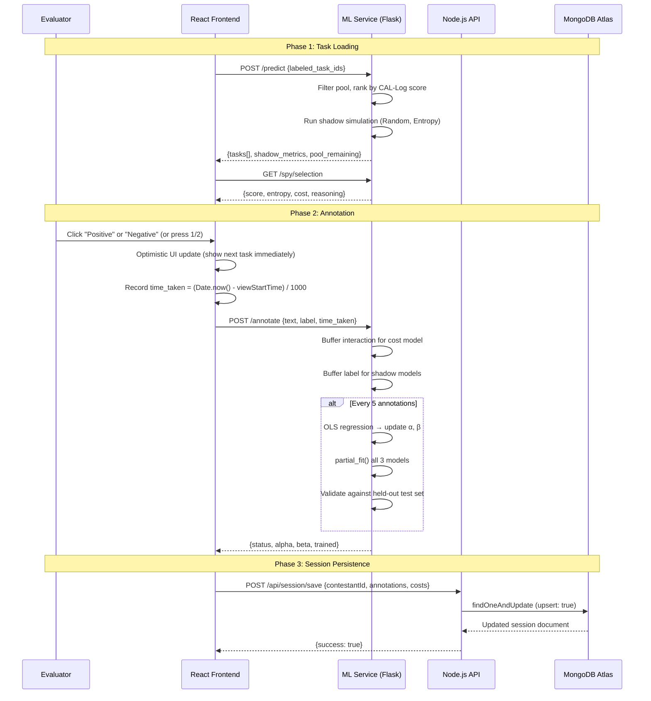

# Request Lifecycle & Data Flow

This page traces the complete lifecycle of a single annotation - from the evaluator clicking a label button to the cost model updating and the next task appearing.

## End-to-End Annotation Flow



## Key Architectural Decisions

### 1. Optimistic UI Updates

When the evaluator clicks a label, the React frontend **immediately** advances to the next task before the network request completes. This is critical because:

- The `time_taken` measurement would be contaminated by network latency if we waited for the server
- The evaluator's annotation "flow state" would be broken by 200-500ms pauses
- The `setSubmitting(false)` call happens right after the optimistic update, not after the fetch

```javascript
// ResearchWorkspace.jsx - optimistic update pattern
const nextTasks = tasks.slice(1);
if (nextTasks.length > 0) {
    setTasks(nextTasks);
    setCurrentTask(nextTasks[0]);  // Show next task IMMEDIATELY
}
setSubmitting(false);  // Re-enable button BEFORE network call

// THEN do the async work (non-blocking)
const response = await fetch(`${API_URL}/annotate`, { ... });
```

### 2. Ref-Based State for Async Handlers

React's `useState` setter is asynchronous, which creates **stale closure bugs** in async handlers. The `labeledIdsRef` ref is used to maintain a synchronous reference:

```javascript
const labeledIdsRef = useRef([]);

// Always update the ref synchronously
const newLabeledIds = [...labeledIdsRef.current, currentTask.id];
labeledIdsRef.current = newLabeledIds;
setLabeledTaskIds(newLabeledIds);  // Also update state for re-renders
```

### 3. Server-Side Pool Management

The ML service maintains its own task pool (`state.clean_pool`) rather than receiving tasks from the frontend. This means:
- The frontend never sees ground-truth labels (prevents leakage)
- Task deduplication happens once at startup
- The pool is shuffled per-session for variety

### 4. Fire-and-Forget Session Saves

Session persistence is non-blocking - the `saveSession()` call uses `.catch()` instead of `await` to prevent slow MongoDB writes from blocking the UI:

```javascript
fetch(`${SERVER_URL}/api/session/save`, {
    method: 'POST',
    headers: { 'Content-Type': 'application/json' },
    body: JSON.stringify(payload)
}).catch(err => console.error('Session save failed:', err));
```

## Polling Architecture

The frontend polls three endpoints every 2 seconds for real-time dashboard updates:

| Endpoint | Data | Consumer |
|----------|------|----------|
| `GET /spy/history` | Alpha/beta convergence timeline | ParameterGraphs |
| `GET /health` | Current alpha, beta, accuracy_history | SpyAnalysis |
| `GET /spy/metrics` | Cumulative costs per strategy | ComparisonTable |

This polling approach was chosen over WebSockets because:
1. The data updates only every 5 annotations (when the model retrains)
2. WebSocket state management adds complexity with no UX benefit
3. Vercel's serverless functions don't support persistent WebSocket connections
