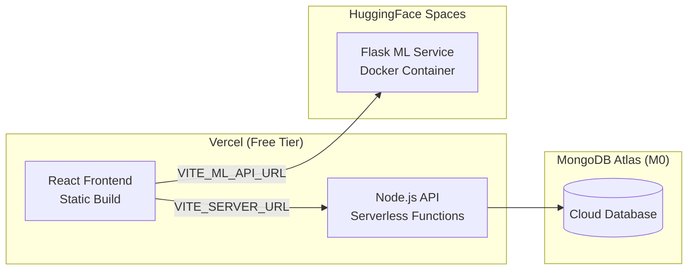

# Deployment Topology

CAL-Log is deployed across three platforms, each chosen for its free-tier availability and academic suitability.

## Production Architecture



## Platform Rationale

| Platform | Component | Why This Platform |
|----------|-----------|-------------------|
| **Vercel** | React frontend + Node.js API | Free SSL, global CDN, serverless functions, zero-config deploys |
| **HuggingFace Spaces** | Flask ML service | Free GPU-enabled Docker hosting, built for ML workloads |
| **MongoDB Atlas** | Database | Free M0 cluster (512MB), managed backups, global availability |

## Docker Configuration (ML Service)

The ML service runs in a Docker container optimised for HuggingFace Spaces:

```dockerfile
FROM python:3.9-slim

WORKDIR /app

# Install system dependencies — clean apt cache to reduce layer size
RUN apt-get update && apt-get install -y \
    build-essential \
    && rm -rf /var/lib/apt/lists/*

# Copy requirements FIRST to leverage Docker layer caching
# Only re-installs deps when requirements.txt changes
COPY ml_service/requirements.txt .
RUN pip install --no-cache-dir -r requirements.txt --timeout 1000

COPY ml_service/ /app/

# HuggingFace Spaces standard port
ENV PORT=7860
EXPOSE 7860

CMD ["python", "simulation_server.py"]
```

### Docker Layer Caching Strategy

Requirements are copied **before** the application code. This means Docker can cache the `pip install` layer and skip it entirely when only Python code changes — reducing rebuild time from ~5 minutes to ~10 seconds.

## Vercel Configuration

Both the React frontend and Node.js API deploy from `vercel.json` configurations:

### Server (`server/vercel.json`)
Routes all API traffic through Express as a single serverless function:
```json
{
  "builds": [{ "src": "index.js", "use": "@vercel/node" }],
  "routes": [{ "src": "/(.*)", "dest": "index.js" }]
}
```

### Client (`client/vercel.json`)
Serves the Vite-built SPA with proper fallback routing:
```json
{
  "rewrites": [{ "source": "/(.*)", "destination": "/index.html" }]
}
```

## Local Development Setup

To run the full stack locally:

```bash
# Terminal 1: Node.js API (Port 5001)
cd server
cp .env.example .env  # Add MONGO_URI
npm install && npm start

# Terminal 2: Flask ML Service (Port 9090)
cd ml_service
pip install -r requirements.txt
python simulation_server.py

# Terminal 3: React Frontend (Port 5173)
cd client
npm install && npm run dev
```

### Environment Variables

| Variable | Location | Purpose |
|----------|----------|---------|
| `MONGO_URI` | `server/.env` | MongoDB Atlas connection string |
| `VITE_ML_API_URL` | `client/.env` | ML service URL (default: `/ml`) |
| `VITE_SERVER_URL` | `client/.env` | Node.js API URL |
| `PORT` | ML service env | Flask port (default: 9090, HF: 7860) |

## Cold Start Handling

HuggingFace Spaces free tier has a **60-90 second cold start** when the container hasn't been accessed recently. The frontend handles this with:

1. **Progressive loading messages** that change every 15 seconds
2. **Exponential backoff** retry (3s → 6s → 12s → 20s)
3. **90-second timeout** on the initial `/predict` request
4. **AbortController** to cancel stale requests when a newer one supersedes
