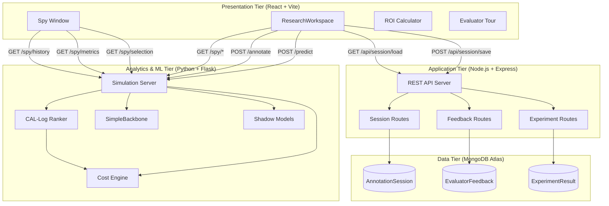

# 4-Tier Architecture Overview

CAL-Log is implemented via a modern, strictly separated **4-Tier Architecture** prioritising stateless scalability and high-performance computation. Each tier runs as an independent process with well-defined API boundaries.

## Architecture Diagram



## Tier 1: Presentation (React + Vite)

**Technology**: React 18, Vite 5, Recharts, Lucide Icons, TailwindCSS

The presentation tier delivers a high-performance UI leveraging **optimistic state updates** for zero-perceived-latency task transitions. Key design decisions:

- **Optimistic UI**: The annotation button re-enables immediately after click, before the network request completes. This eliminates the latency bottleneck that would bias the `time_taken` measurement.
- **Component Isolation**: The `TaskCard` is visually separated from the `SpyWindow` to prevent the mathematical readouts from adding cognitive load during annotation.
- **Recharts (SVG-based)**: Chosen over canvas-based charting libraries because SVG charts render crisply at any zoom level — critical for viva presentation on projectors.

### Key Components
| Component | Lines | Purpose |
|-----------|-------|---------|
| `ResearchWorkspace.jsx` | 725 | Main container, state management, API orchestration |
| `TaskCard.jsx` | 121 | Binary classification interface with timer |
| `SpyAnalysis.jsx` | 57 | Spy Window sidebar coordinator |
| `SessionSummary.jsx` | ~500 | Post-session results and export |
| `ROICalculator.jsx` | 214 | Financial impact projection |

## Tier 2: Application (Node.js + Express)

**Technology**: Express 4, Mongoose 8, CORS, dotenv

The application tier serves as a robust RESTful API orchestrating:
- **Session persistence**: Atomic upsert operations for evaluator progress
- **Feedback collection**: Validated qualitative survey ingestion
- **Experiment data**: Pre-seeded benchmark results for comparison charts

### Security Middleware Stack
```
express.json() → CORS whitelist → OPTIONS preflight → OWASP headers → Routes
```

## Tier 3: Analytics & ML (Python + Flask)

**Technology**: Flask, scikit-learn, NumPy, SentenceTransformers

The computationally intensive tier isolating the CAL-Log ranking engine:
- **SimulationState**: Singleton state object shared across all route handlers
- **AdaptiveCostModel**: OLS regression for real-time alpha/beta estimation
- **CALLogRanker**: Score = Entropy / Cost ranking implementation
- **Shadow Benchmarking**: Parallel random and entropy baselines for live comparison

## Tier 4: Data (MongoDB Atlas)

**Technology**: MongoDB 4.4+ (Atlas Cloud), Mongoose ODM

Three collections with purpose-built schemas:
- **AnnotationSession**: Evaluator progress with embedded annotation sub-documents
- **EvaluatorFeedback**: Post-session survey with Likert-scale validation
- **ExperimentResult**: Benchmark results with compound indexing

### Why MongoDB over SQL?

1. **Schema flexibility**: Annotation details vary per session (embedded sub-docs)
2. **Atlas free tier**: M0 cluster provides zero-cost cloud hosting for research
3. **Mongoose ODM**: Built-in validation (enum, min/max) eliminates manual checks
4. **~50 annotations per session**: Well within the 16MB document limit
