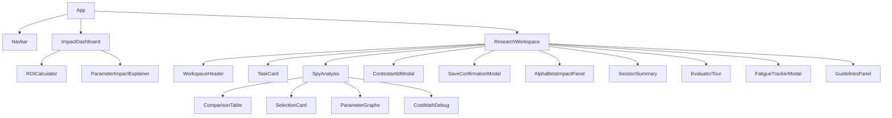

# React Application Structure

**Stack**: React 18 + Vite 5 + TailwindCSS + Recharts + Lucide Icons

## Entry Point

### `main.jsx`

```jsx
import React from "react";
import ReactDOM from "react-dom/client";
import App from "./App.jsx";
import "./index.css";

ReactDOM.createRoot(document.getElementById("root")).render(
  <React.StrictMode>
    <App />
  </React.StrictMode>
);
```

`React.StrictMode` runs components twice in development to catch side effects — this is why you might see doubled console logs during dev.

### `App.jsx` — Routing

```jsx
import { BrowserRouter as Router, Routes, Route, Link } from "react-router-dom";

function App() {
  return (
    <Router>
      <div className="min-h-screen bg-slate-950 text-slate-200">
        <Navbar />
        <Routes>
          <Route path="/" element={<ImpactDashboard />} />
          <Route path="/spy" element={<ResearchWorkspace />} />
          <Route path="/impact" element={<ImpactDashboard />} />
          <Route path="*" element={<ImpactDashboard />} />
        </Routes>
      </div>
    </Router>
  );
}
```

**Route structure**:
| Path | Component | Purpose |
|------|-----------|---------|
| `/` | ImpactDashboard | Public landing page with ROI calculator |
| `/spy` | ResearchWorkspace | Evaluator annotation interface |
| `/impact` | ImpactDashboard | Alias for `/` |
| `*` | ImpactDashboard | Catch-all redirect |

## Component Hierarchy



## Environment Variables

Vite exposes environment variables via `import.meta.env` (not `process.env`):

```javascript
const API_URL = import.meta.env.VITE_ML_API_URL || "/ml";
const SERVER_URL = (import.meta.env.VITE_SERVER_URL || "").replace(/\/$/, "");
```

| Variable | Default | Purpose |
|----------|---------|---------|
| `VITE_ML_API_URL` | `/ml` | Flask ML service URL |
| `VITE_SERVER_URL` | `""` | Node.js API URL |

## Dependencies

| Package | Version | Purpose |
|---------|---------|---------|
| `react` | 18.3.1 | UI library |
| `react-dom` | 18.3.1 | DOM rendering |
| `react-router-dom` | 6.30.3 | Client-side routing |
| `recharts` | 3.7.0 | SVG-based data visualisation |
| `lucide-react` | 0.454.0 | Tree-shakable icon components |
| `react-joyride` | 2.9.3 | Evaluator onboarding tour |
| `axios` | 1.13.6 | HTTP client (used in some components) |

## Build & Dev

```bash
npm run dev     # Vite dev server (HMR, port 5173)
npm run build   # Production bundle → dist/
npm run preview # Preview production build locally
```
