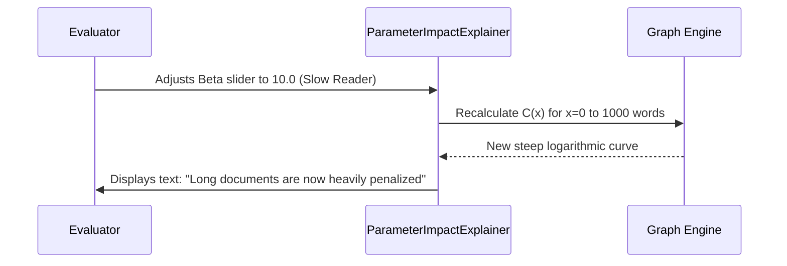

# Parameter Impact Components

These components are crucial for **viva defensibility**. They provide the evaluator with absolute transparency regarding how the system's dynamic parameters ($\alpha$ and $\beta$) affect the underlying cost calculations and algorithm behavior.

## AlphaBetaImpactPanel

**File**: `client/src/components/workspace/AlphaBetaImpactPanel.jsx`  
**Role**: A real-time, interactive dashboard located inside the Spy Window that visualizes the current Alpha and Beta values, comparing them against the system's baseline.

### Key Features
1. **Real-time Delta Visualization**: Displays arrows (↑/↓) indicating whether the user's current Alpha/Beta is higher or lower than the "cold start" defaults ($\alpha=5.0$, $\beta=3.0$).
2. **Reading Profile Translation**: Converts the raw numerical $\beta$ value into a human-readable profile (e.g., "Fast Skimmer" for $\beta < 1.5$, "Careful Reader" for $\beta > 3.0$).
3. **Dynamic Explanations**: Changes the explanatory text based on the parameters. For example, if $\alpha$ is high, it explains that the user takes longer to switch tasks, so the system will favor longer texts to amortize that overhead.

### Viva Summary
> [!NOTE]
> **For the Viva**: The `AlphaBetaImpactPanel` is the system's "dashboard". It proves that the system isn't just a black box doing math in the background. It surfaces the learned parameters immediately, proving to the evaluator that the OLS regression successfully captured their reading speed, and explains in plain English *why* certain texts are being selected.

## ParameterImpactExplainer

**File**: `client/src/components/ParameterImpactExplainer.jsx`  
**Role**: A dedicated interactive tool (often accessible via a "Learn More" modal or settings) that lets users manually adjust hypothetical Alpha and Beta sliders to see how the mathematical curve shifts.

### Key Features
1. **Interactive Sliders**: Users can drag sliders for $\alpha$ (0 to 15s) and $\beta$ (0.1 to 15.0).
2. **Live Graph Updates**: As the sliders move, a chart re-renders the $C(x) = \alpha + \beta \ln(1 + L(x))$ curve.
3. **"What-If" Analysis**: This component visually demonstrates the core thesis of the paper: higher $\alpha$ shifts the y-intercept up (penalizing short texts heavily), while higher $\beta$ makes the curve steeper (penalizing long texts heavily).

### The Feedback Loop

