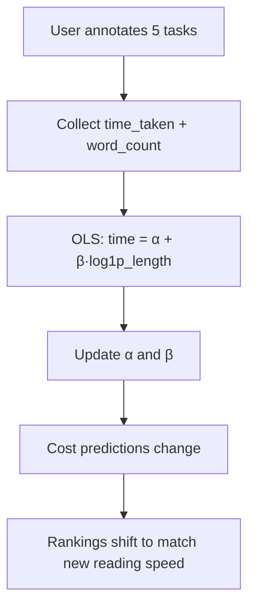

# The CAL-Log Cost Function

The cost function is the mathematical heart of CAL-Log. It predicts how many seconds an annotator will take to read and classify a given text, based on its word count and the annotator's observed reading speed.

## Viva Summary
> [!NOTE]
> **For the Viva**: To decide if a task is "worth it", the system needs to guess how long it will take you to read. We found that reading time doesn't scale linearly (a 1000-word text doesn't take 10x longer than a 100-word text because you read faster once you understand the context). Therefore, we use a **Logarithmic Cost Function**: $C(x) = \alpha + \beta \ln(1 + L(x))$. Alpha is the fixed time it takes you to switch tasks and click buttons. Beta is your unique reading speed. The system learns these parameters specifically for you.

### Visualizing the Math


## Formula

$$
C(x) = \alpha + \beta \cdot \ln(1 + L(x))
$$

Where:
- $C(x)$ = predicted annotation cost in **seconds**
- $\alpha$ = **fixed cognitive overhead** (task-switching, reading the prompt, making a decision)
- $\beta$ = **reading speed multiplier** (higher = slower reader)
- $L(x)$ = **word count** of text $x$
- $\ln(1 + L(x))$ = natural logarithm of $(1 + \text{word count})$

## Why Logarithmic, Not Linear?

A linear cost model ($C = \alpha + \beta \cdot L$) would predict that a 1000-word text takes 10× longer than a 100-word text. In practice, reading speed increases with context — after understanding the topic of a text, subsequent paragraphs process faster. The logarithm captures this **diminishing marginal cost** of additional words.

```
Linear:      Cost grows proportionally with length
Logarithmic: Cost grows SLOWLY after the initial investment
```

$$
\begin{aligned}
\text{100 words:} \quad \ln(1 + 100) &= 4.62 \\
\text{500 words:} \quad \ln(1 + 500) &= 6.22 \quad (\text{only 1.35× more, not 5×})\\
\text{1000 words:} \quad \ln(1 + 1000) &= 6.91 \quad (\text{only 1.50× more, not 10×})
\end{aligned}
$$

## Cold-Start Defaults

Before the system has observed enough annotations to estimate parameters:

| Parameter | Default | Rationale |
|-----------|---------|-----------|
| $\alpha$ | 5.0 seconds | Typical time to switch context, read prompt, decide |
| $\beta$ | 3.0 | Conservative middle ground between fast and slow readers |

These defaults produce reasonable costs:
- **50-word text**: $5.0 + 3.0 \times \ln(51) = 5.0 + 11.8 = 16.8s$
- **200-word text**: $5.0 + 3.0 \times \ln(201) = 5.0 + 15.9 = 20.9s$

## Implementation

The cost function is implemented in [`cost_engine.py`](/ml-service/cost-engine):

```python
class AdaptiveCostModel:
    def __init__(self):
        self.alpha = 5.0  # Cold start (will be overwritten by regression)
        self.beta = 3.0   # Cold start (will be overwritten by regression)

    def _heuristic_cost(self, log_length: float) -> float:
        """Calculate cost: C(x) = alpha + beta * log(1 + L(x))"""
        return self.alpha + (self.beta * log_length)

    def predict(self, text_lengths: list) -> np.ndarray:
        """Predict annotation cost for a list of text lengths."""
        log_lengths = np.log1p(text_lengths)  # ln(1 + x), numerically stable
        predicted_costs = [self._heuristic_cost(l) for l in log_lengths]
        return np.array(predicted_costs)
```

### Why `np.log1p()` instead of `np.log(1 + x)`?

`log1p(x)` is mathematically equivalent to `log(1 + x)` but uses a different numerical algorithm that avoids **catastrophic cancellation** when `x` is very small. For short texts (1-5 words), `1 + x` rounds to nearly 1.0 in floating-point, making `log(1 + x)` imprecise. `log1p` handles this edge case correctly.

## How Parameters Adapt

After every 5 annotations, the system runs **OLS regression** on the annotator's actual reading times to update $\alpha$ and $\beta$. See [OLS Regression](/mathematics/ols-regression) for the full estimation procedure.

The parameter update flow dynamically shifts your cost baseline:


