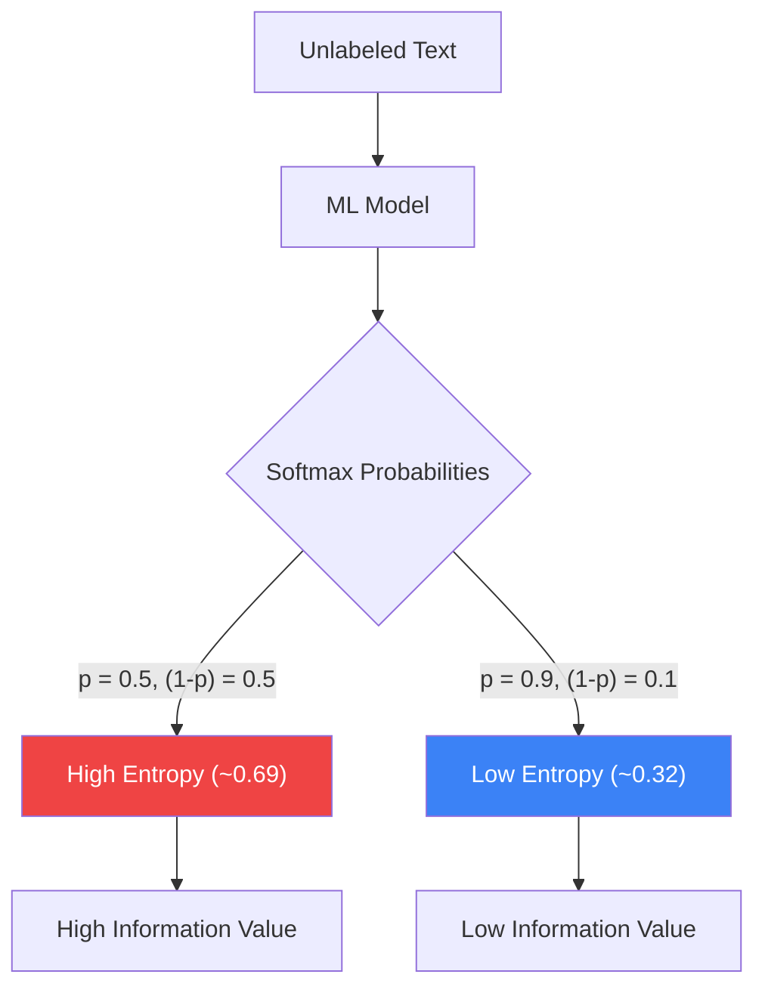

# Shannon Entropy for Uncertainty Quantification

Shannon entropy measures **how uncertain** the classifier is about a text's label. Texts where the model is most uncertain are the most valuable for retraining - this is the foundational principle of **uncertainty sampling** in active learning.

## Viva Summary
> [!NOTE]
> **For the Viva**: Entropy is simply a mathematical measure of "how confused the model is". If the model predicts [0.99, 0.01], it's very confident (Low Entropy). If it predicts [0.5, 0.5], it's completely guessing (High Entropy). By finding the texts with the highest entropy, we find the texts that will teach the model the most if you label them. However, picking *only* by high entropy often selects extremely long, exhausting texts-which is exactly what the CAL-Log formula is designed to prevent by dividing Entropy by Cost.

### Visualizing Entropy Scoring



## Formula

For a binary classification task with predicted probabilities $p$ and $(1-p)$:

$$
H(x) = -\sum_{c=1}^{C} P(c|x) \cdot \ln P(c|x)
$$

For binary classification ($C = 2$):

$$
H(x) = -[p \cdot \ln(p) + (1-p) \cdot \ln(1-p)]
$$

## Entropy Values

| Model Output | Entropy $H(x)$ | Interpretation |
|-------------|-----------------|----------------|
| [0.5, 0.5] | **0.693** (max) | Complete uncertainty - maximum information value |
| [0.6, 0.4] | 0.673 | Slight lean - still very informative |
| [0.8, 0.2] | 0.500 | Moderate confidence - some information value |
| [0.95, 0.05] | 0.199 | High confidence - low information value |
| [0.99, 0.01] | 0.056 | Near-certain - annotating this teaches almost nothing |

## Why CAL-Log Doesn't Just Use Entropy

Standard uncertainty sampling picks the **highest entropy** texts. The problem: high-entropy texts are often **long, ambiguous documents** because longer texts are harder for the model to classify. This creates a selection bias toward exhausting tasks.

CAL-Log fixes this by dividing entropy by cost:

$$
\text{Score}(x) = \frac{H(x)}{C(x)} = \frac{\text{Information Value}}{\text{Time Investment}}
$$

A 200-word text with entropy 0.65 and a 50-word text with entropy 0.60 might rank differently:

$$
\text{Long text:} \quad \frac{0.65}{20.9s} = 0.031 \quad\text{bits/sec}
$$

$$
\text{Short text:} \quad \frac{0.60}{16.8s} = 0.036 \quad\text{bits/sec} \quad \leftarrow \text{CAL-Log picks this}
$$

The short text delivers more information per second of human effort.

## Implementation

```python
class CALLogRanker:
    def calculate_entropy(self, probabilities: np.ndarray) -> np.ndarray:
        """
        Shannon entropy for model predictions.
        
        Args:
            probabilities: Shape (n_tasks, n_classes)
        Returns:
            entropy: Shape (n_tasks,) - higher = more uncertain
        """
        epsilon = 1e-9  # Prevent log(0) → -inf
        entropy = -np.sum(probabilities * np.log(probabilities + epsilon), axis=1)
        return entropy
```

### Why `epsilon = 1e-9`?

When the model is 100% confident ($p = 1.0$), the entropy formula computes $1.0 \times \ln(1.0) = 0$, which is fine. But when $p = 0.0$, it computes $0 \times \ln(0)$, and $\ln(0) = -\infty$. The $\epsilon$ prevents this numerical explosion:

$$
\ln(0 + 10^{-9}) = \ln(10^{-9}) \approx -20.7
$$

$$
0 \times (-20.7) \approx 0 \quad \text{(safe, near-zero contribution)}
$$

## Entropy Source: SimpleBackbone

The probabilities fed into the entropy calculation come from the `SimpleBackbone`'s `predict_proba()` method, which uses an SGDClassifier with `loss='log_loss'` (logistic regression). This ensures:

1. **Calibrated probabilities** - log loss training produces probability estimates that are meaningful (unlike SVMs or raw SGD)
2. **Incremental updates** - `partial_fit()` allows online learning without reprocessing old data
3. **Speed** - prediction over 200 candidates takes under 50ms
