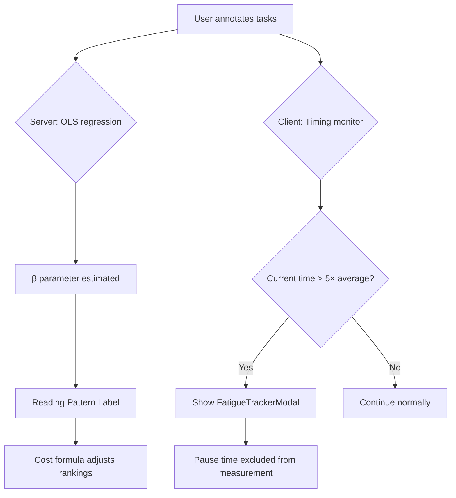

# Reading Pattern Classification & Fatigue Detection

CAL-Log models annotator fatigue through two mechanisms: the **reading pattern classifier** (server-side, derived from β) and the **fatigue detector** (client-side, derived from annotation timing).

## Reading Pattern Classification

The reading pattern is derived purely from the β parameter - no hardcoded conditions on task selection:

| β Range | Pattern | Behaviour |
|---------|---------|-----------|
| β < 1.5 | **Fast Skimmer** | Length penalty reduced → cost formula naturally favours longer, high-entropy tasks |
| 1.5 ≤ β ≤ 3.0 | **Balanced** | Standard entropy/cost ratio optimisation |
| β > 3.0 | **Careful Reader** | Length penalty increased → cost formula naturally favours shorter, high-entropy tasks |

### Key Design Principle

The system does **not** contain any `if fast_skimmer: pick_long_tasks()` logic. The classification is purely observational - a label applied to the current β value. The ranking behaviour emerges naturally from the cost formula:

When β is high (careful reader):
$$
C(\text{long}) = \alpha + \underbrace{5.0}_{\text{high β}} \cdot \ln(1 + 500) = \alpha + 31.1 \quad \text{(expensive!)}
$$

$$
C(\text{short}) = \alpha + 5.0 \cdot \ln(1 + 50) = \alpha + 19.6 \quad \text{(much cheaper)}
$$

The division $H(x) / C(x)$ naturally pushes shorter texts up the ranking when β is high, without any explicit rule.

## Implementation

```python
def get_reading_pattern(self):
    """Analyze user's reading pattern based on current alpha and beta."""
    WINDOW_SIZE = 5
    recent_history = self.user_history[-WINDOW_SIZE:]
    
    if len(recent_history) < 3:
        return {
            "pattern": "insufficient_data",
            "description": "Not enough data to determine pattern",
            "beta": None,
            "alpha": self.alpha,
            "avg_time": None
        }
    
    avg_time = np.mean([h[1] for h in recent_history])
    
    if self.beta < 1.5:
        pattern = "fast_skimmer"
        description = "Fast reader - low beta means cost formula naturally favors longer high-entropy tasks"
    elif self.beta > 3.0:
        pattern = "careful_reader"
        description = "Careful reader - high beta means cost formula naturally favors shorter high-entropy tasks"
    else:
        pattern = "balanced"
        description = "Balanced pace - cost formula optimizes entropy/cost ratio normally"
    
    return {
        "pattern": pattern,
        "description": description,
        "beta": round(self.beta, 2),
        "alpha": round(self.alpha, 2),
        "baseline_beta": 3.0,
        "avg_time": round(avg_time, 1),
        "sample_size": len(recent_history)
    }
```

## Client-Side Fatigue Detection

Independent of the server-side reading pattern, the React frontend monitors annotation timing to detect when the evaluator might be fatigued or distracted:

```javascript
// ResearchWorkspace.jsx - Fatigue detection logic
if (annotationTimes.length >= 3) {
    // Trim top 20% longest times to remove outliers (coffee breaks, etc.)
    const sortedTimes = [...annotationTimes].sort((a, b) => a - b);
    const validTimes = sortedTimes.slice(0, Math.floor(sortedTimes.length * 0.8));
    const avgSeconds = validTimes.reduce((acc, val) => acc + val, 0) / validTimes.length;

    // Trigger fatigue warning if current task takes 5× the trimmed average
    // Minimum threshold of 30 seconds prevents false positives for fast readers
    const threshold = Math.max(avgSeconds * 5, 30);

    if (elapsed > threshold && !isFatigueModalOpen && !fatigueTriggeredForTask) {
        setIsFatigueModalOpen(true);
        setFatigueTriggeredForTask(true);
    }
}
```

### Why Trim the Top 20%?

Without trimming, a single 2-minute coffee break would inflate the average to ~30s, making the 5× threshold 150 seconds - far too lenient to detect actual fatigue. The trimmed mean (P80) provides a robust baseline that ignores extreme outliers.

### Fatigue Pause Time Accounting

When the fatigue modal appears, the time spent looking at the modal is **excluded** from the annotation time measurement:

```javascript
const timeTaken = ((Date.now() - viewStartTime) - fatiguePauseTime) / 1000;
```

This ensures the cost model receives clean reading time data, not modal-viewing time.

## Interaction Between Server and Client Fatigue Systems



The two systems are **complementary but independent**:
- **Server-side** (β): Adjusts which tasks are served (shorter vs longer)
- **Client-side** (timing): Detects when to suggest a break (does not affect task selection)
