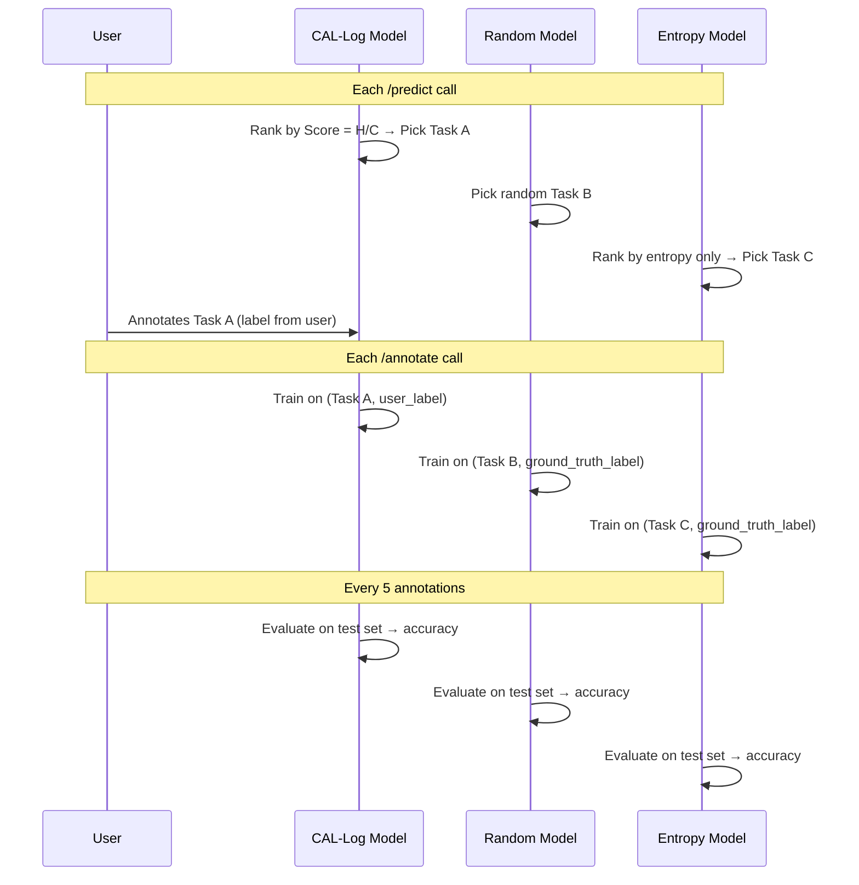

# Shadow Benchmarking System

The shadow benchmarking system is CAL-Log's built-in experimental control. It runs three task selection strategies **simultaneously** on the same data, using the same model architecture, to produce a fair comparison without needing three separate human evaluators.

## The Problem

To prove CAL-Log works, we need to compare it against baselines. But running three separate annotation studies requires:
- 3× the human evaluators (expensive and slow)
- Perfect control of confounding variables (impossible in practice)
- Enough statistical power per group (requires large sample sizes)

## The Solution: Shadow Models

Instead of separate studies, we run three **independent model instances** that each maintain their own training data and weights:

```python
self.models = {
    'cal_log': self.backbone,                    # Primary model (user trains this)
    'random': SimpleBackbone(num_labels=2),      # Shadow - independent weights
    'entropy': SimpleBackbone(num_labels=2)      # Shadow - independent weights
}
```

### How It Works



### Key Insight: Ground-Truth Labels for Shadows

The user only annotates the task that **CAL-Log** selected. The shadow models can't ask the user to label their picks. Instead, they use **ground-truth labels** from the dataset:

```python
# In /annotate handler
rnd_task = state.last_shadow_picks['random']
rnd_lbl = state.id_to_label.get(rnd_task['id'], 0)  # Look up actual label
state.pending_labels_random += [(rnd_task['text'], rnd_lbl)]
```

This simulates what would have happened if the Random/Entropy strategy had been in control - the model would have been trained on those tasks with their true labels.

## Shadow Metrics Calculation

For each strategy, the `/predict` endpoint computes:

```python
def calc_metrics(picks):
    for p in picks:
        length = len(p['text'].split())
        entropy_val = p['transparency_report']['math_proof']['entropy']
        cost = p['transparency_report']['cost_analysis']['predicted_seconds']
    
    # Information efficiency = entropy resolved per second
    info_efficiency = avg_entropy / max(avg_cost, 0.1)
    
    return {
        "avg_len": ...,
        "estimated_cost": ...,
        "avg_entropy": ...,
        "info_efficiency": ...,      # bits per second
        "selected_ids": [...],
        "audit_trail": [...]
    }
```

The **information efficiency** metric (`bits/sec`) is the key comparison:
- **CAL-Log**: Optimises this directly via Score = H/C
- **Entropy**: High entropy but potentially high cost (picks long uncertain texts)
- **Random**: Neither optimised - serves as a baseline

## Cumulative Cost Tracking

Running totals of predicted annotation cost per strategy:

```python
state.cumulative_costs = {'cal_log': [], 'entropy': [], 'random': []}

# After each /predict:
state.cumulative_costs['cal_log'].append(shadow_metrics['cal_log']['estimated_cost'])
state.cumulative_costs['entropy'].append(shadow_metrics['entropy']['estimated_cost'])
state.cumulative_costs['random'].append(shadow_metrics['random']['estimated_cost'])
```

These feed the **ROI comparison charts** in the Spy Window, showing projected cost divergence over time.

## Validation Phase

Every 5 annotations, all three models are evaluated on the **same held-out test set** (first 100 items):

```python
X_test = [t['text'] for t in state.test_set]
y_test = [t['label'] for t in state.test_set]

for name, model in state.models.items():
    preds = model.predict(X_test)
    acc = np.mean([1 if p == y else 0 for p, y in zip(preds, y_test)])
    scores[name] = round(acc, 3)
```

This produces the **accuracy convergence graph** - the primary evidence that CAL-Log achieves comparable accuracy to alternatives while using less human time.

## Why This Is Academically Valid

1. **Same architecture**: All three models use identical `SimpleBackbone` (TF-IDF + SGD) - the only variable is task selection
2. **Same pre-training**: All models are pre-trained on the same 200-sample seed
3. **Same evaluation**: All models are tested on the same held-out set at the same intervals
4. **Fair label access**: Each model trains on the labels for tasks **it** would have selected
5. **Reproducible**: `random_state=42` in SGDClassifier ensures deterministic initialisation
