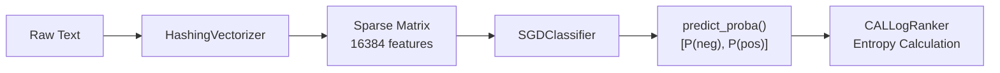

# simple_backbone.py — ML Model Pipeline

**File**: `ml_service/utilities/simple_backbone.py` (106 lines)  
**Role**: Provides a fast, offline-first text classification model using HashingVectorizer + SGDClassifier. This is the model that produces the probability estimates fed into the entropy calculation.

## Design Rationale

### Why Not Use a Transformer (BERT, RoBERTa)?

| Concern | Transformer | SimpleBackbone |
|---------|------------|----------------|
| **Download size** | ~500MB model weights | **0 bytes** (no downloads) |
| **Memory usage** | 2-4GB GPU RAM | **~50MB** CPU RAM |
| **Cold start** | 30-60 seconds | **under 1 second** |
| **Incremental learning** | Full fine-tuning required | **`partial_fit()` in under 100ms** |
| **Offline capable** | Needs download on first run | **100% offline** |

For the active learning simulation, the model's absolute accuracy doesn't matter — what matters is the **relative uncertainty** between texts. A TF-IDF + SGD model provides sufficient entropy signal for ranking while enabling true online learning via `partial_fit()`.

## Class: `SimpleBackbone`

### Constructor & Vectorizer

```python
class SimpleBackbone:
    def __init__(self, num_labels=2):
        self.num_labels = num_labels
        self.vectorizer = HashingVectorizer(
            n_features=2**14,       # 16,384 features
            alternate_sign=False    # All positive values
        )
```

**HashingVectorizer** uses the "hashing trick" to map tokens to a **fixed-size** sparse matrix:
- No vocabulary dictionary → flat memory usage even on huge corpora
- `n_features=2**14` (16,384) — good balance between hash collisions and speed
- `alternate_sign=False` — keeps all values positive for consistency with TF-IDF interpretation

### SGDClassifier Configuration

```python
        self.classifier = SGDClassifier(
            loss='log_loss',     # Logistic regression → calibrated probabilities
            penalty='l2',        # L2 regularisation to prevent overfitting
            alpha=0.0001,        # Regularisation strength
            random_state=42,     # Reproducible weight init
            max_iter=1000,
            tol=1e-3
        )
```

**Why `loss='log_loss'`?** This trains the model as a logistic regression classifier, which produces **calibrated probability estimates**. Without log loss (e.g., using `'hinge'` for SVM), `predict_proba()` would return poorly calibrated values, making entropy calculations meaningless.

**Why `penalty='l2'`?** L2 regularisation prevents the model from memorising the small batches it sees during incremental learning. With only 5 new samples per `partial_fit()` call, overfitting is a real risk.

### `_warmup()` — Classifier Initialisation

```python
def _warmup(self):
    dummy_X = self.vectorizer.transform(["init"])
    dummy_y = [0]
    self.classifier.partial_fit(dummy_X, dummy_y, classes=self.classes_)
    self.is_fitted = True
```

`partial_fit()` requires a `classes=` argument on its **first call** to initialise the weight matrix dimensions. The warmup uses a dummy sample to set this up, so subsequent calls don't need to pass `classes` again.

### `predict_proba()` — Probability Estimates

```python
def predict_proba(self, texts):
    X = self.vectorizer.transform(texts)
    return self.classifier.predict_proba(X)
```

Returns a `(N, 2)` array where each row is `[P(Negative), P(Positive)]`. These probabilities are fed directly into `CALLogRanker.calculate_entropy()`.

### `predict()` — Hard Labels

```python
def predict(self, texts):
    X = self.vectorizer.transform(texts)
    return self.classifier.predict(X)
```

Returns class labels (0 or 1). Used only during the **validation phase** to compute accuracy against the held-out test set.

### `partial_fit()` — Online Learning

```python
def partial_fit(self, texts, labels):
    unique_labels = set(labels)
    if len(unique_labels) < 2:
        logger.warning(f"Training with only {len(unique_labels)} class: {unique_labels}")
    
    X = self.vectorizer.transform(texts)
    self.classifier.partial_fit(X, labels, classes=self.classes_)
```

This is the key method for **incremental learning**:
- Called every 5 annotations with the new batch
- Does not reprocess old data — only the 5 new samples update the weights
- `classes=self.classes_` is passed every time for safety (required by some sklearn versions)
- Warning logged when only one class is present (model can't learn a decision boundary from one class)

## Pipeline Flow


