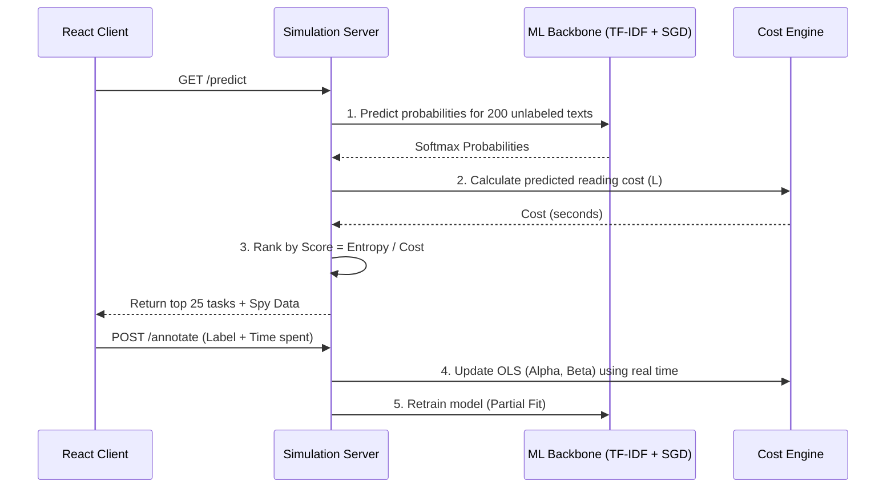

# simulation_server.py — Complete Walkthrough

**File**: `ml_service/simulation_server.py` (837 lines)  
**Role**: Flask-based entry point for the Analytics & ML tier. Hosts all endpoints, manages the singleton `SimulationState`, and orchestrates the active learning loop.

## Viva Summary
> [!NOTE]
> **For the Viva**: The Simulation Server is the heart of the CAL-Log system. It operates as a Flask API that holds a **Singleton State** in memory. This state maintains the offline ML models, the dataset pool, and the cost estimation engine. When the frontend requests tasks (`/predict`), the server calculates the Shannon Entropy and the predicted reading cost for 200 candidates, divides Entropy by Cost, and returns the top 25 highest-efficiency tasks. It also quietly simulates "Random" and "Pure Entropy" strategies in the background to generate comparative benchmark data.

### The CAL-Log Active Learning Loop



## Imports & Initialization (Lines 1-36)

```python
import os, json, numpy as np, logging
from flask import Flask, request, jsonify
from flask_cors import CORS
import sys, random

sys.path.append(os.path.dirname(os.path.abspath(__file__)))

from utilities.simple_backbone import SimpleBackbone
from cost_engine import AdaptiveCostModel
from models.cal_log_ranker import CALLogRanker
from sklearn.feature_extraction.text import TfidfVectorizer
from sklearn.metrics.pairwise import cosine_similarity
import re
```

**Key decisions**:
- `sys.path.append()` ensures sibling package imports work regardless of the working directory (Docker, HuggingFace, or local dev)
- `CORS(app)` is required because the React frontend runs on a different port (5173) than Flask (9090)
- All ML dependencies are imported at the top level so import errors fail fast at startup, not at request time

## SimulationState Class (Lines 65-256)

The `SimulationState` class is a **singleton** instantiated once at module load. Flask's dev server is single-threaded, so no locking is needed.

### `__init__()` — Boot Sequence

```python
class SimulationState:
    def __init__(self):
        # 1. Initialize cost model with cold-start defaults (α=5.0, β=3.0)
        self.cost_model = AdaptiveCostModel()
        
        # 2. Initialize ML backbone (TF-IDF + SGD — zero downloads, 100% offline)
        self.backbone = SimpleBackbone(num_labels=2)
        
        # 3. Initialize ranker (needs cost_model reference for Score = H/C)
        self.ranker = CALLogRanker(self.cost_model)
        
        # 4. State counters
        self.step = 0
        self.steps_since_update = 0    # Triggers cost model update at 5
        self.steps_since_train = 0      # Triggers model retrain at 5
        self.history = []
        self.interaction_buffer = []    # Rolling buffer for cost model
        self.selected_task_lengths = [] # Track selection history
```

### Shadow Models Setup

```python
        # 3 separate models trained on identical data but using different selection strategies
        self.models = {
            'cal_log': self.backbone,          # Shares reference with main backbone
            'random': SimpleBackbone(num_labels=2),    # Independent weights
            'entropy': SimpleBackbone(num_labels=2)    # Independent weights
        }
```

**Why three models?** To prove CAL-Log is actually better, we run Random and Entropy strategies "in the shadows" — they pick their own tasks, get trained on the ground-truth labels for those tasks, and their accuracy is compared. This eliminates the need for three separate human evaluators.

### Dataset Loading

```python
        self.dataset = []
        self.id_to_label = {}
        with open("dataset.json", "r") as f:
            raw = json.load(f)
            for i, r in enumerate(raw):
                txt = r.get('data', {}).get('text') or r.get('text', "")
                l_str = r.get('true_label') or r.get('label')
                lbl = 1 if l_str == 'Positive' else 0
                if txt:
                    self.dataset.append({'id': i, 'text': txt, 'label': lbl})
                    self.id_to_label[i] = lbl
```

- Handles two JSON schemas (`data.text` or `text`) for backward compatibility
- Binary encoding: `'Positive' → 1`, `'Negative' → 0`
- `id_to_label` dictionary enables O(1) ground-truth lookup for shadow model training

### Pool Split

```python
        self.test_set = self.dataset[:100]  # Hidden test set
        self.pool = self.dataset[100:]       # Available for annotation
```

The first 100 items are reserved as a **held-out test set** that the annotator never sees. After every 5 annotations, all three models are evaluated against this test set to produce the accuracy comparison graphs.

### Pre-training

```python
    def _pretrain_seed(self):
        seed = random.sample(self.clean_pool, min(200, len(self.clean_pool)))
        X = [d['text'] for d in seed]
        y = [d['label'] for d in seed]
        if len(set(y)) >= 2:
            for name, model in self.models.items():
                model.partial_fit(X, y)
```

All three models are pre-trained on a random 200-sample seed so the first `/predict` call returns meaningful entropy values instead of uniform distributions.

---

## `/predict` Endpoint (Lines 276-550)

This is the most complex endpoint. It performs task selection, ranking, shadow simulation, and Spy Window data generation.

### Step 1: Filter Available Tasks

```python
available = [t for t in state.clean_pool if t['id'] not in labeled_ids]
batch_size = min(200, len(available))
candidates = available[:batch_size]
```

Only the first 200 unlabeled tasks are considered as candidates. This balances ranking accuracy with latency (under 5s).

### Step 2: Text Preprocessing

```python
def preprocess_text(text):
    text = re.sub(r'\s+', ' ', text).strip()       # Collapse whitespace
    text = re.sub(r'[^a-zA-Z0-9\s.,!?\'\-]', '', text)  # Strip special chars
    return text
```

Cleaning happens before vectorisation to ensure consistent feature extraction.

### Step 3: Rank by CAL-Log Score

```python
probs = state.backbone.predict_proba(texts)        # Shape: (200, 2)
ranked_candidates = state.ranker.rank_by_cal_log(normalized_candidates, probs)
ranked_results = ranked_candidates[:25]             # Top 25 to client
```

The ranker computes `Score = Entropy / Cost` for all 200 candidates, sorts descending, and the top 25 are sent to the frontend.

### Step 4: Shadow Simulation

```python
cal_log_picks = ranked_candidates[:3]

# Entropy baseline: shuffle first to break length bias, then sort by entropy
pool_for_entropy = ranked_candidates.copy()
random.shuffle(pool_for_entropy)
entropy_picks = sorted(pool_for_entropy, key=lambda x: x['transparency_report']['math_proof']['entropy'], reverse=True)[:3]

# Random baseline
random_picks = random.sample(ranked_candidates, min(3, len(ranked_candidates)))
```

The shadow simulation answers: "What would Random/Entropy have picked right now?" by computing their metrics on the same candidate pool.

### Step 5: Spy Data Generation

```python
spy_data = {
    "selected_task_id": top['id'],
    "score": top['score'],
    "entropy": top['transparency_report']['math_proof']['entropy'],
    "cost": top['transparency_report']['cost_analysis']['predicted_seconds'],
    "alpha": state.cost_model.alpha,
    "beta": state.cost_model.beta,
    "reasoning": f"Score ({top['score']:.3f}) = Entropy (...) / Cost (...) ...",
    "task_stats": { ... },
    "reading_pattern": reading_pattern,
    "pattern_reasoning": pattern_reasoning
}
```

This data feeds the Spy Window's "Selection Reasoning" card, providing full mathematical transparency.

---

## `/annotate` Endpoint (Lines 606-748)

Processes each annotation and triggers the learning cycle.

### Cost Model Update (Every 5 Annotations)

```python
if state.steps_since_update >= 5:
    state.cost_model.update(state.interaction_buffer)
    state.steps_since_update = 0
    state.history.append({
        "step": state.step,
        "alpha": state.cost_model.alpha,
        "beta": state.cost_model.beta
    })
```

### Shadow Label Propagation

```python
# Ground-truth labels for the tasks the shadow strategies WOULD have picked
rnd_task = state.last_shadow_picks['random']
rnd_lbl = state.id_to_label.get(rnd_task['id'], 0)
state.pending_labels_random += [(rnd_task['text'], rnd_lbl)]
```

This is critical: shadow models are trained on the labels of the tasks **they** selected, not the tasks the user annotated. Otherwise the comparison would be invalid.

### Model Retraining (Every 5 Annotations)

```python
def commit_train(name, buffer_name):
    data = getattr(state, buffer_name, [])
    X = [d[0] for d in data]
    y = [d[1] for d in data]
    state.models[name].partial_fit(X, y)
    setattr(state, buffer_name, [])

commit_train('cal_log', 'pending_labels_cal_log')
commit_train('random', 'pending_labels_random')
commit_train('entropy', 'pending_labels_entropy')
```

### Validation Phase

```python
X_test = [t['text'] for t in state.test_set]
y_test = [t['label'] for t in state.test_set]

for name, model in state.models.items():
    preds = model.predict(X_test)
    acc = np.mean([1 if p == y else 0 for p, y in zip(preds, y_test)])
    scores[name] = round(acc, 3)
```

All three models are evaluated against the same held-out test set, producing the accuracy convergence graph in the Spy Window.

---

## `/reset` Endpoint (Lines 750-823)

Performs a complete session reset for a new contestant: fresh backbone, cost model, shuffled pool, and cleared history.

## Entry Point (Lines 825-837)

```python
if __name__ == "__main__":
    port = int(os.environ.get("PORT", 9090))
    app.run(host='0.0.0.0', port=port)
```

- `host='0.0.0.0'` binds to all interfaces (required for Docker)
- `PORT` env var allows HuggingFace Spaces to override the default
