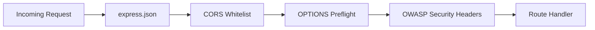

# server/index.js - Application Entry Point

**File**: `server/index.js` (89 lines)  
**Role**: Node.js + Express server initialisation, middleware chain, and route mounting.

## Middleware Chain

The Express middleware chain processes every incoming request in order:



### 1. JSON Body Parser

```javascript
app.use(express.json());
```

Built-in since Express 4.16+. Parses incoming JSON bodies and attaches them to `req.body`. Without this, POST route handlers would receive `undefined` when accessing `req.body`.

### 2. CORS Whitelist

```javascript
app.use(cors({
  origin: [
    "https://alx-label-app-research-tool.vercel.app",
    "http://localhost:5173",
    "http://localhost:4173"
  ],
  credentials: true
}));
```

- Only three origins are allowed (production Vercel, dev server, preview server)
- `credentials: true` enables cookies and auth headers across origins
- Any request from an unlisted origin receives no CORS headers → blocked by the browser

### 3. OPTIONS Preflight Handler

```javascript
app.use((req, res, next) => {
  if (req.method === 'OPTIONS') {
    res.header('Access-Control-Allow-Origin', req.headers.origin);
    res.header('Access-Control-Allow-Methods', 'GET,POST,PUT,DELETE,OPTIONS');
    res.header('Access-Control-Allow-Headers', 'Content-Type, Authorization');
    res.header('Access-Control-Allow-Credentials', 'true');
    return res.sendStatus(204);
  }
  next();
});
```

Browsers send an OPTIONS request before POST/PUT/DELETE requests (CORS preflight). This handler responds with `204 No Content` and the required headers so the browser proceeds with the actual request.

### 4. OWASP Security Headers

```javascript
app.use((req, res, next) => {
  res.setHeader('X-Content-Type-Options', 'nosniff');
  res.setHeader('X-Frame-Options', 'DENY');
  res.setHeader('Strict-Transport-Security', 'max-age=63072000; includeSubDomains; preload');
  res.setHeader('Referrer-Policy', 'strict-origin-when-cross-origin');
  res.setHeader('Permissions-Policy', 'camera=(), microphone=(), geolocation=()');
  next();
});
```

| Header | Purpose |
|--------|---------|
| `X-Content-Type-Options: nosniff` | Prevent MIME-type sniffing attacks |
| `X-Frame-Options: DENY` | Block clickjacking via iframes |
| `Strict-Transport-Security` | Force HTTPS for 2 years |
| `Referrer-Policy` | Limit referrer information leakage |
| `Permissions-Policy` | Disable camera, microphone, geolocation |

## Route Mounting

```javascript
app.use("/api/experiments", require("./infrastructure/http/routes/experiment"));
app.use("/api/session", require("./infrastructure/http/routes/session"));
app.use("/api/feedback", require("./infrastructure/http/routes/feedback"));
```

All routes are mounted under the `/api` namespace following RESTful conventions.

## Database Connection

```javascript
const connectDB = require("./config/db");
connectDB();
```

See [Database Models](/server/database-models) for the MongoDB connection configuration.

## Server Startup

```javascript
const PORT = process.env.PORT || 5001;
if (require.main === module) {
  server.listen(PORT, () => {
    console.log(`Server running on port ${PORT}`);
  });
}
module.exports = app;
```

- `require.main === module` - only start listening when run directly, not when imported for testing
- `module.exports = app` - exports the Express app for Vercel's serverless adapter

## MongoDB Connection (`config/db.js`)

```javascript
const connectDB = async () => {
  try {
    await mongoose.connect(process.env.MONGO_URI, {
      serverSelectionTimeoutMS: 30000,  // 30s for Atlas cold starts
      socketTimeoutMS: 45000,
      bufferCommands: true,
      maxPoolSize: 5,  // Atlas M0 free tier caps at 500 total
    });
  } catch (err) {
    // Single retry with 3s delay for transient cold-start failures
    setTimeout(async () => {
      await mongoose.connect(process.env.MONGO_URI, { ... });
    }, 3000);
  }
};
```

**Key configuration**:
- `maxPoolSize: 5` - Atlas M0 free tier caps at 500 connections total; keeping the pool small is critical
- `bufferCommands: true` - queue DB operations until the connection is ready (prevents errors during cold start)
- `bufferTimeoutMS: 30000` - cap how long queued operations wait
